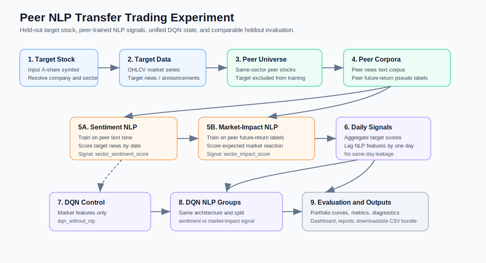

# NLP-Driven Reinforcement Learning Trading Platform

本项目是一个面向金融科技课程项目的端到端实验平台，用于研究：

```text
raw financial news + OHLCV market data
-> peer-trained NLP signal
-> DQN trading decision
-> evaluation, dashboard, and report artifacts
```

本仓库实现的实验是：

```text
Peer NLP Transfer Trading Experiment
```

核心问题是：

```text
当目标股票自己的 NLP 训练被严格排除时，
由同板块 peer stocks 训练出来的 NLP signal，
是否能提升目标股票 DQN 交易模型的测试期表现？
```

实验包含两个 peer-trained NLP 信号：

```text
Experiment A: sector peer sentiment NLP
Experiment B: sector peer market-impact NLP
```

## Experimental Logic

以目标股票 `A` 为例，例如：

```text
target stock A = 002475 立讯精密
sector = electronics
peer stocks = 同板块除 A 以外的股票
```

目标股票永远不进入自己的 NLP 训练语料：

```text
target stock news is excluded from NLP training
target stock future returns are excluded from NLP labelling
```

当前正式比较组为：

| Group | Strategy | DQN state |
|---|---|---|
| Benchmark | buy_and_hold | no DQN |
| Group 0 | dqn_without_nlp | market features + zero NLP signal |
| Group 1 | dqn_with_sector_sentiment_nlp | market features + sector peer sentiment |
| Group 2 | dqn_with_sector_impact_nlp | market features + sector peer market-impact |
| Optional | dqn_with_marketwide_sentiment_nlp | market features + marketwide peer sentiment |
| Optional | dqn_with_marketwide_impact_nlp | market features + marketwide peer market-impact |

默认 dashboard 使用 `sector_only`，也就是只跑同板块训练集。`sector_plus_marketwide` 是额外 benchmark，会更慢。

## Why Peer NLP

本项目遇到的现实问题是：很多 A 股新闻接口在远端历史区间的信息密度很低，近端约 30 到 80 个交易日新闻明显更密集。

因此，直接用目标股票自己的长期新闻训练 NLP 会有两个问题：

1. 远端新闻稀疏，NLP 信号不稳定。
2. 如果用目标股票自己的近端新闻训练再测试，容易形成 self-training / self-testing contamination。

所以当前实验改为：

```text
同板块其他股票的近端高密度新闻
-> train peer NLP
-> score target stock A 的近端高密度新闻
-> sentiment or impact signal enters DQN state
-> test whether DQN improves
```

这使实验更接近 transfer learning：

```text
learn from peer stocks
transfer to held-out target stock
```

## End-To-End Workflow



完整流程如下：

```text
1. User inputs target symbol
2. Resolve company name and sector
3. Load or fetch target market/news data
4. Detect target high-information-density window
5. Identify same-sector peer stocks
6. Load or fetch peer market/news data
7. Build sector peer sentiment corpus
8. Build sector peer market-impact labelled corpus
9. Train or fit peer sentiment NLP
10. Train or fit peer market-impact NLP
11. Score target stock news
12. Aggregate daily target signals
13. Build lagged DQN features
14. Pretrain shared market-only DQN backbone
15. Fine-tune each DQN group with its own NLP signal
16. Evaluate each group on the same holdout window
17. Compute trading metrics
18. Generate figures and dashboard outputs
19. Export report HTML and CSV bundle
```

Dashboard 里每一步会显示为：

```text
pending -> running -> completed / skipped / failed
```

## Data Windows

默认研究区间：

```text
DATA_START_DATE = 2024-01-01
DATA_END_DATE   = 2026-04-30
```

对目标股票，系统先检测高信息密度窗口：

```text
high-density window = news cumulative distribution reaches recent dense segment
```

时间上分为三段：

```text
market-learning window:
    高密度窗口之前的目标股票市场数据

high-density fine-tune window:
    高密度窗口前半段

high-density holdout window:
    高密度窗口后半段
```

在代码输出中对应：

```text
outputs/stocks/<symbol>/reports/market_impact_train_eval_windows.csv
```

## Mathematical Formulation

### 1. Market Data

目标股票在交易日 `t` 的 OHLCV 为：

```text
M_t = (O_t, H_t, L_t, C_t, V_t)
```

其中：

```text
O_t = open price
H_t = high price
L_t = low price
C_t = close price
V_t = volume
```

日收益率定义为：

```text
r_t = (C_t - C_{t-1}) / C_{t-1}
```

未来 `h` 日收益率：

```text
R_{t,h} = (C_{t+h} - C_t) / C_t
```

### 2. Technical Indicators

移动平均：

```text
MA_k(t) = (1 / k) * sum_{i=0}^{k-1} C_{t-i}
```

本项目使用：

```text
MA50(t), MA200(t)
```

RSI 使用标准相对强弱指标：

```text
RSI(t) = 100 - 100 / (1 + RS(t))
RS(t) = AvgGain_n(t) / AvgLoss_n(t)
```

MACD：

```text
MACD(t) = EMA_12(t) - EMA_26(t)
Signal(t) = EMA_9(MACD(t))
```

在 DQN 中使用的所有市场特征都会滞后一日：

```text
feature_for_action_t = feature_observed_at_{t-1}
```

这样保证：

```text
action at t uses information available before t
```

### 3. Peer Sentiment NLP

对 peer stock `j` 的新闻文本：

```text
x_{j,i} = title_{j,i} + content_{j,i}
```

Peer sentiment model 输出三类概率：

```text
P(pos | x), P(neu | x), P(neg | x)
```

数值 sentiment score 定义为：

```text
sentiment_score(x) = P(pos | x) - P(neg | x)
```

对于目标股票 `A` 在交易日 `t` 的新闻集合：

```text
N_A(t) = {x_{A,i}: news i mapped to trading day t}
```

日度 sector sentiment：

```text
S_sector(t) =
    0, if |N_A(t)| = 0
    (1 / |N_A(t)|) * sum_{x in N_A(t)} sentiment_score_sector(x), otherwise
```

同时记录：

```text
news_available(t) = 1 if |N_A(t)| > 0 else 0
```

无新闻日的 `0` 表示 no signal，不等价于 neutral news。

### 4. Market-Impact NLP

Market-impact NLP 的思想是：

```text
新闻语气不一定等于交易信号。
正面新闻不一定上涨，负面新闻不一定下跌。
```

因此本项目构造 peer news 的未来收益伪标签。

对 peer stock `j` 的新闻 `x_{j,i}`，先映射到交易日 `tau(i)`，然后计算：

```text
R_{j, tau(i), h} = (C_{j, tau(i)+h} - C_{j, tau(i)}) / C_{j, tau(i)}
```

默认：

```text
h = 3
positive_threshold = 0.015
negative_threshold = -0.015
```

伪标签：

```text
y_{j,i} =
    bullish_impact, if R_{j,tau(i),3} > 0.015
    bearish_impact, if R_{j,tau(i),3} < -0.015
    neutral_impact, otherwise
```

重要限制：

```text
这些 label 只在 peer corpus 内创建。
目标股票 A 的未来收益绝不用于训练 A 的 NLP scorer。
```

训练 market-impact classifier：

```text
f_impact(x) -> [P(bullish), P(neutral), P(bearish)]
```

impact score：

```text
impact_score(x) = P(bullish | x) - P(bearish | x)
```

目标股票日度 impact signal：

```text
I_sector(t) =
    0, if |N_A(t)| = 0
    (1 / |N_A(t)|) * sum_{x in N_A(t)} impact_score_sector(x), otherwise
```

### 5. News-To-Trading-Date Alignment

如果新闻没有明确 intraday timestamp，本项目采用保守规则：

```text
calendar news date d -> next valid trading date
```

也就是说：

```text
news from d becomes tradable at t >= next_trading_day(d)
```

如果有 timestamp，则可扩展为：

```text
pre-market news -> same trading day
after-market news -> next trading day
```

最终进入 DQN 的 NLP signal 仍然滞后一日：

```text
NLP_state_t = NLP_signal_{t-1}
```

### 6. Unified DQN State

为了避免不同实验组 state 维度不同，所有 DQN group 统一使用 8 维 state：

```text
s_t = [
    price_t,
    MA50_t,
    MA200_t,
    RSI_t,
    MACD_t,
    position_t,
    cash_t,
    nlp_signal_score_t
]
```

其中：

```text
price_t, MA50_t, MA200_t, RSI_t, MACD_t
```

都是滞后后的市场特征。

不同组唯一差别是最后一列：

```text
dqn_without_nlp:
    nlp_signal_score_t = 0

dqn_with_sector_sentiment_nlp:
    nlp_signal_score_t = S_sector(t-1)

dqn_with_sector_impact_nlp:
    nlp_signal_score_t = I_sector(t-1)

dqn_with_marketwide_sentiment_nlp:
    nlp_signal_score_t = S_marketwide(t-1)

dqn_with_marketwide_impact_nlp:
    nlp_signal_score_t = I_marketwide(t-1)
```

这保证：

```text
same DQN architecture
same state dimension
same train/test window
same reward function
same seeds
only NLP signal source changes
```

### 7. Two-Stage DQN Training

为避免只用近端几十天从零训练 DQN，本项目使用两段式训练：

#### Stage 1: Market-Only Pretraining

在远端 market-learning window 上训练共同 DQN backbone：

```text
s_t^pretrain = [
    price_t, MA50_t, MA200_t, RSI_t, MACD_t, position_t, cash_t, 0
]
```

得到参数：

```text
theta_0
```

#### Stage 2: Group-Specific Fine-Tuning

每个实验组从同一个 `theta_0` 复制：

```text
theta_g(0) = theta_0
```

然后在目标股票近端 high-density fine-tune window 上训练：

```text
theta_g = FineTune(theta_0, D_g)
```

其中 `D_g` 的最后一列由 group 决定：

```text
0, sector sentiment, sector impact, marketwide sentiment, marketwide impact
```

#### Stage 3: Holdout Evaluation

所有 group 在同一个 high-density holdout window 测试：

```text
Evaluate(theta_g, D_test)
```

最终比较：

```text
Performance(dqn_with_signal) - Performance(dqn_without_nlp)
```

### 8. Trading Environment

动作空间：

```text
a_t in {0, 1, 2}
0 = Hold
1 = Buy
2 = Sell
```

现金与持仓：

```text
cash_t
shares_t
```

组合价值：

```text
V_t = cash_t + shares_t * price_t
```

交易成本：

```text
cost_t = transaction_cost_rate * traded_value_t
```

如果 Buy 或 Sell 执行，扣除交易成本；Hold 不产生交易成本。

### 9. Reward Function

当前主 reward 是 portfolio return：

```text
reward_t = (V_{t+1} - V_t) / V_t
```

如果需要更稳健，可切换到带惩罚项的 reward：

```text
reward_t = portfolio_return_t - lambda_turnover * turnover_t
```

或：

```text
reward_t = portfolio_return_t - lambda_drawdown * drawdown_t
```

但正式主实验默认保持：

```text
reward_mode = portfolio_return
```

### 10. DQN Update

DQN 学习 action-value function：

```text
Q(s_t, a_t; theta)
```

TD target：

```text
y_t = r_t + gamma * max_a' Q_target(s_{t+1}, a'; theta^-)
```

Loss：

```text
L(theta) = E[(y_t - Q(s_t, a_t; theta))^2]
```

经验回放 buffer：

```text
ReplayBuffer = {(s_t, a_t, r_t, s_{t+1}, done_t)}
```

探索策略：

```text
epsilon-greedy
```

```text
a_t =
    random action, with probability epsilon
    argmax_a Q(s_t, a; theta), otherwise
```

目标网络定期同步：

```text
theta^- <- theta
```

本项目从 scratch 使用 PyTorch 实现 DQN，不使用 Stable-Baselines3。

## Evaluation Metrics

对每个 strategy 计算：

```text
final_equity
cumulative_return
annualized_return
annualized_volatility
sharpe_ratio
sortino_ratio
calmar_ratio
max_drawdown
number_of_trades
win_rate
exposure_ratio
turnover
average_holding_period
action_entropy
```

累计收益：

```text
cumulative_return = V_T / V_0 - 1
```

年化收益：

```text
annualized_return = (V_T / V_0)^(252 / N) - 1
```

年化波动率：

```text
annualized_volatility = std(r_t) * sqrt(252)
```

Sharpe Ratio：

```text
Sharpe = mean(r_t - r_f) / std(r_t) * sqrt(252)
```

Sortino Ratio：

```text
Sortino = mean(r_t - r_f) / downside_std(r_t) * sqrt(252)
```

最大回撤：

```text
Drawdown_t = V_t / max_{k<=t}(V_k) - 1
MaxDrawdown = min_t Drawdown_t
```

展示时通常使用正数：

```text
MaxDrawdownDisplayed = abs(MaxDrawdown)
```

NLP 效果：

```text
sector_sentiment_effect =
    final_equity(dqn_with_sector_sentiment_nlp)
    - final_equity(dqn_without_nlp)

sector_impact_effect =
    final_equity(dqn_with_sector_impact_nlp)
    - final_equity(dqn_without_nlp)
```

如果使用 marketwide：

```text
marketwide_sentiment_effect =
    final_equity(dqn_with_marketwide_sentiment_nlp)
    - final_equity(dqn_without_nlp)

marketwide_impact_effect =
    final_equity(dqn_with_marketwide_impact_nlp)
    - final_equity(dqn_without_nlp)
```

## Signal Validity Diagnostics

为了证明 NLP signal 是否有交易相关性，系统会计算：

```text
corr(signal_t, return_{t+1})
corr(signal_t, return_{t+3})
corr(signal_t, return_{t+5})
```

Information Coefficient：

```text
IC_h = corr(signal_t, R_{t,h})
```

分位数未来收益：

```text
E[R_{t,h} | signal_t in quantile q]
```

Hit rate：

```text
hit_rate_high =
    P(R_{t,h} > 0 | signal_t in top quantile)

hit_rate_low =
    P(R_{t,h} < 0 | signal_t in bottom quantile)
```

这些诊断用于解释：

```text
sentiment NLP = text tone
market-impact NLP = learned expected market reaction
```

## Main Output Files

每只股票的输出位于：

```text
outputs/stocks/<symbol>/
```

主要结构：

```text
outputs/stocks/<symbol>/data/
outputs/stocks/<symbol>/reports/
outputs/stocks/<symbol>/results/
outputs/stocks/<symbol>/models/
```

核心结果文件：

```text
outputs/stocks/<symbol>/results/peer_nlp_daily_sentiment.csv
outputs/stocks/<symbol>/results/peer_market_impact_daily_signal.csv
outputs/stocks/<symbol>/results/market_impact_ablation_metrics.csv
outputs/stocks/<symbol>/results/market_impact_ablation_metrics_by_seed.csv
outputs/stocks/<symbol>/results/market_impact_portfolio_curves.csv
outputs/stocks/<symbol>/results/market_impact_trading_logs.csv
outputs/stocks/<symbol>/results/market_impact_effect_summary.csv
outputs/stocks/<symbol>/reports/market_impact_train_eval_windows.csv
outputs/stocks/<symbol>/reports/market_impact_group_state_diagnostics.csv
outputs/stocks/<symbol>/reports/market_impact_reliability_check.csv
```

全局表格：

```text
reports/tables/stock_sector_mapping.csv
reports/tables/peer_nlp_corpus_summary.csv
reports/tables/market_impact_corpus_summary.csv
reports/tables/signal_validity_summary.csv
reports/tables/market_impact_effect_summary.csv
```

## Installation

```bash
cd /Users/luxinyu/Desktop/Fintech/fintechgp
python3 -m venv .venv
source .venv/bin/activate
pip install -r requirements.txt
```

如果需要 Jupyter：

```bash
.venv/bin/python -m ipykernel install --user --name fintechgp --display-name "Python (.venv fintechgp)"
```

## Run Dashboard

Dashboard 入口：

```bash
.venv/bin/streamlit run src/dashboard/peer_nlp_dashboard.py
```

或启动 peer dashboard CLI：

```bash
.venv/bin/python main.py --peer-dashboard
```

Dashboard 左侧输入：

```text
Target symbol
Company name
Date range
Market source priority
News cap
DQN episodes
Peer corpus scope
```

输入目标股票后，dashboard 会自动显示：

```text
Experiment set:
    target stock only

Training peer set:
    same-sector stocks excluding target stock
```

点击：

```text
Run target experiment
```

会按完整流程执行：

```text
data -> peer corpus -> NLP -> DQN -> metrics -> figures -> export
```

Dashboard 默认启用 SQLite 持久化。运行时仍以 CSV 文件作为主要可审计产物，同时会把核心数据同步写入：

```text
outputs/database/trading_platform.db
```

入库内容包括目标股票 market/news、peer sentiment daily signals、peer market-impact daily signals、DQN trading logs、ablation metrics。注意：页面中显示的 peer/training plan 来自配置表；只有点击运行并成功抓取后，对应股票才会出现在 `outputs/stocks/<symbol>/data/` 和 SQLite 数据库中。

## Run CLI

单只股票实验：

```bash
.venv/bin/python main.py \
  --symbol 002475 \
  --company-name 立讯精密 \
  --start-date 2024-01-01 \
  --end-date 2026-04-30 \
  --run-ingestion \
  --run-nlp \
  --run-rl \
  --run-ablation \
  --run-market-impact-nlp \
  --allow-fetch-missing-sector-peers \
  --use-sqlite \
  --episodes 200
```

如果只想跑同板块 sector-only，应在 dashboard 选择：

```text
Peer corpus scope = sector_only
```

如果要额外跑 marketwide benchmark：

```text
Peer corpus scope = sector_plus_marketwide
```

## Run Notebook

```bash
.venv/bin/jupyter notebook notebooks/full_report_pipeline.ipynb
```

Notebook 用于报告型复现实验。Dashboard 更适合交互式运行和检查进度。

## Data Cache Logic

系统会避免同一股票反复生成冗余数据。

当前主缓存目录是：

```text
outputs/stocks/<symbol>/data/
```

旧目录 `data/integrated/` 只作为 legacy fallback。不要用顶层 `data/` 文件数量判断当前实验是否已经具备所有 peer 数据；正式运行会先检查 `outputs/stocks/<symbol>/data/`，缺失时再调用 scraper 从线上数据源补齐。

每只股票保留一个 master timeline：

```text
outputs/stocks/<symbol>/data/<symbol>_finance_text_master.csv
```

运行前检查：

```text
if master covers requested date range:
    slice master and analyze
else:
    fetch missing interval
    merge into master
    deduplicate
    materialize requested slice
```

这样可以保证：

```text
same stock data is not repeatedly duplicated
cross-stock CSV format remains consistent
```

## SQLite Storage

SQLite 是 dashboard/CLI 的同步存储层，不替代 CSV 审计文件。默认数据库路径：

```text
outputs/database/trading_platform.db
```

核心表：

```text
market_table
news_table
sentiment_table
nlp_signal_table
experiment_metrics_table
trading_log_table
```

`nlp_signal_table` 以 long-form 保存 sector/marketwide sentiment 和 market-impact daily signals；`experiment_metrics_table` 以 normalized metric rows 保存 DQN/ablation 指标。重新运行同一股票同一 source 的 daily signal 和 metrics 会 upsert，trading logs 会 append，便于保留运行轨迹。

## Project Structure

```text
config/
docs/
notebooks/
program/
program/finance_scraper/
outputs/
reports/
scripts/
src/data_ingestion/
src/storage/
src/nlp/
src/features/
src/rl/
src/evaluation/
src/reporting/
src/dashboard/
tests/
```

重要模块：

```text
src/data_ingestion/ingestion.py
    data cache, market data, news data, master timeline

src/nlp/peer_sentiment.py
    peer sentiment corpus and daily sentiment signal

src/nlp/market_impact.py
    future-return-labelled market-impact NLP

src/evaluation/market_impact_ablation.py
    unified 8-D DQN state, pretrain, fine-tune, holdout evaluation

src/rl/trading_env.py
    chronological trading environment

src/rl/dqn_agent.py
    PyTorch DQN from scratch

src/rl/train.py
    DQN train and evaluate utilities

src/dashboard/peer_nlp_dashboard.py
    peer NLP and market-impact dashboard
```

## Reliability Checks

系统会检查：

```text
target stock excluded from NLP training
same-sector peer count
training news count
market-impact labelled news count
high-density window length
target news coverage
lagged state features
same-day leakage
DQN trade count
flat portfolio curves
```

如果条件不足，结果会标记为：

```text
READY_FOR_PRESENTATION
READY_WITH_WARNINGS
NOT_READY
```

## Known Limitations

1. A 股新闻接口远端历史新闻密度低，因此当前实验重点放在近端高密度窗口。
2. Market-impact label 是 pseudo label，不是真实人工标注。
3. 如果同板块 peer stocks 不足，sector NLP 会被标记为 insufficient。
4. 如果 marketwide impact labelled news 不足，marketwide impact group 会被跳过。
5. DQN 结果受随机种子、交易成本、训练 episode、市场状态影响，需要多 seed 聚合解释。
6. NLP signal 改善 DQN 并不保证稳定发生，可能取决于板块、市场 regime、新闻覆盖率和 signal quality。
